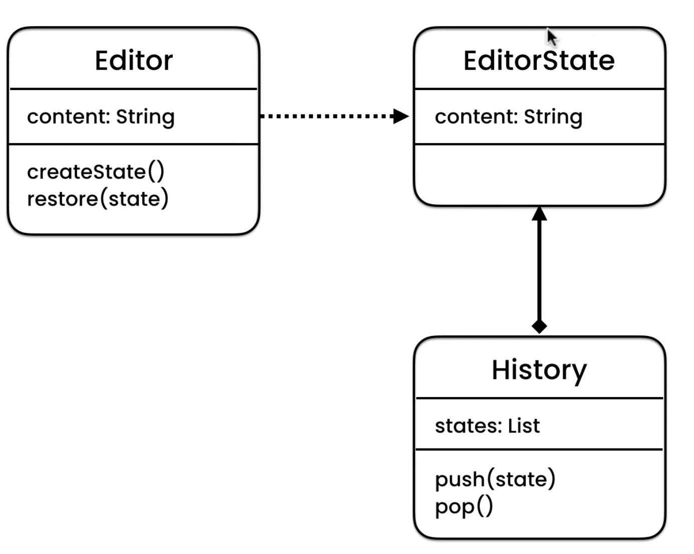
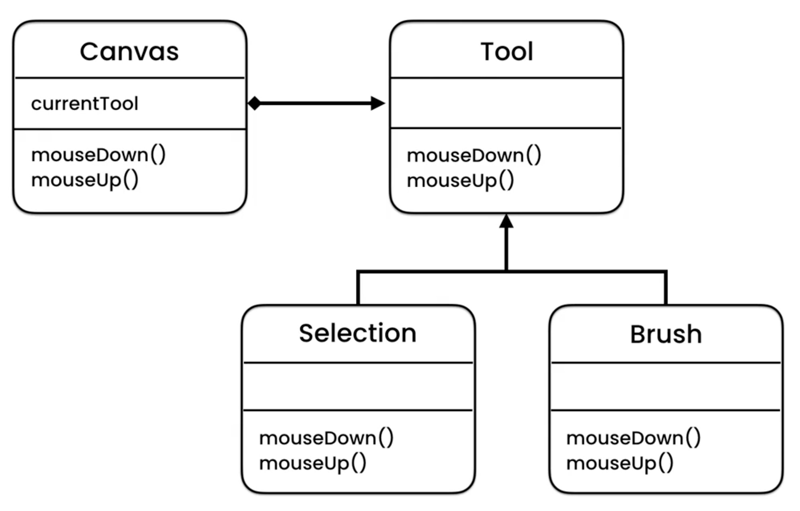
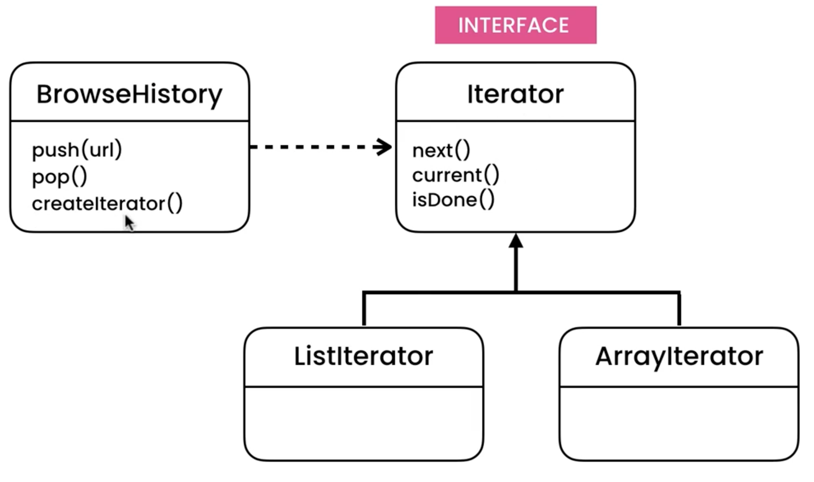
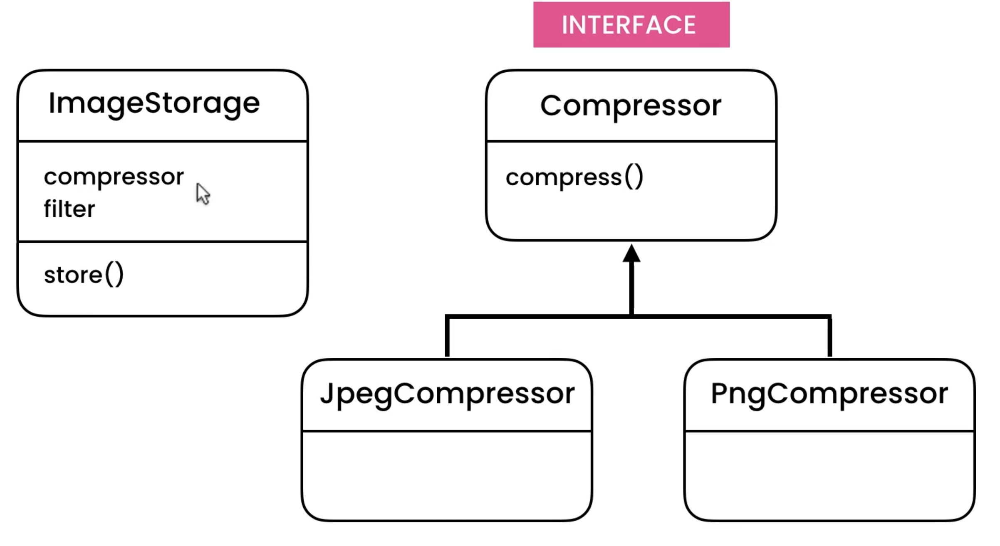
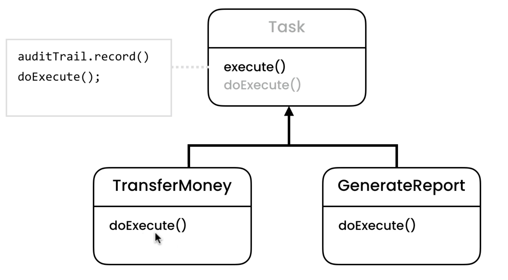
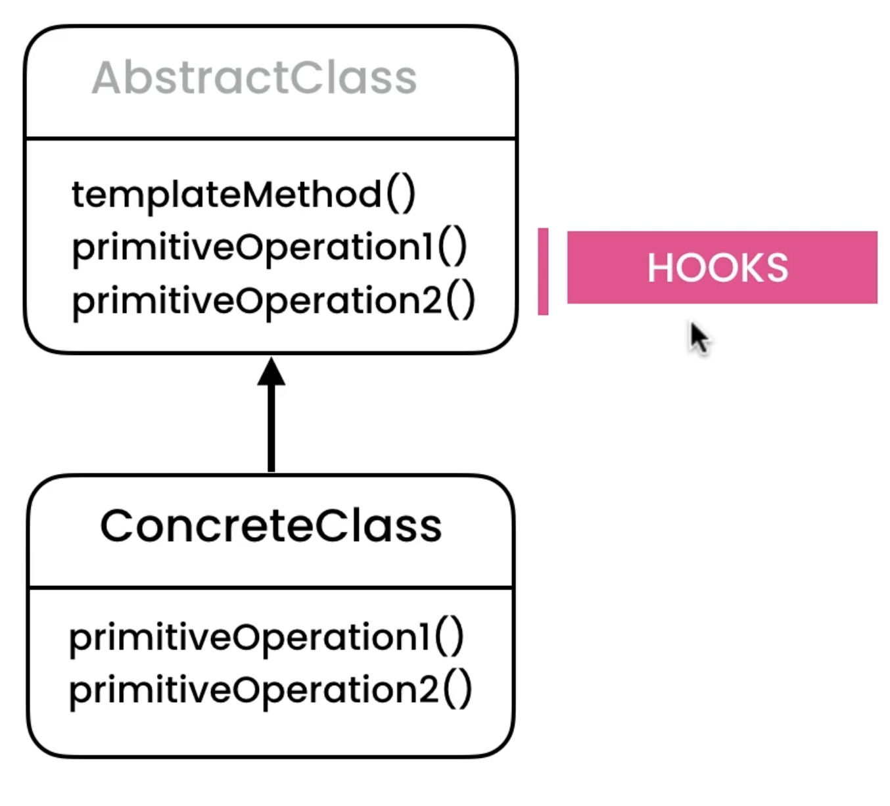

# Design Patterns

This repo is about various design patterns.

## Memento Pattern

It is used to implement an **undo mechanism**. The memento pattern is
a software design pattern that provides the ability to restore an
object to its previous state. The memento pattern is implemented
with three objects: the originator, a caretaker and a memento.
The originator is some object that has an internal state.

* Editor = Originator
* EditorState = Memento
* History = CareTaker

## State Pattern

State pattern allows an object to behave differently when the state
changes (polymorphism).

The state pattern is used in computer programming to encapsulate
varying behavior for the same object, based on its internal state.
This can be a cleaner way for an object to change its behavior at
runtime without resorting to conditional statements and thus improve
maintainability.

* Canvas =  Context
* Tool = State
* Selection = ConcreteStateA
* Brush = ConcreteStateB

## Iterator Pattern

Iterator pattern is very commonly used design pattern in Java and
.Net programming environment. This pattern is used to get a way
to access the elements of a collection object in sequential manner
without any need to know its underlying representation.

Iterator is a behavioral design pattern that lets you traverse elements
of a collection without exposing its underlying representation
(list, stack, tree, etc.).

## Strategy Pattern

Strategy is a behavioral design pattern that lets you define a family of
algorithms, put each of them into a separate class, and make their objects
interchangeable.

## Template Pattern

In Template pattern, an abstract class exposes defined way(s)/template(s)
to execute its methods. Its subclasses can override the method implementation
as per need but the invocation is to be in the same way as defined by an abstract
class. This pattern comes under behavior pattern category.

